<div align="center">

# 🌐 MY_NET Enterprise NOC
### Carrier-Grade Unified Network Operations & Telemetry Platform

[](https://github.com/mahamudulhasaankhan/MY_NET_NOC)
[](https://www.linkedin.com/in/md-mahamudul-hassan-khan/)
[](LICENSE)
[](docs/ARCHITECTURE_OVERVIEW.md)
[](docs/USER_GUIDE.md)

**Engineered by [Md. Mahamudul Hassan Khan](https://www.linkedin.com/in/md-mahamudul-hassan-khan/) — Enterprise ISP & Telco Grade**

</div>

---

## 📌 What Is MY_NET Enterprise NOC?

**MY_NET Enterprise NOC** is an end-to-end, carrier-grade network intelligence and automation platform built for Internet Service Providers (ISPs), Data Centers, and Enterprise Networks.

It manages your entire network fabric from a single pane of glass — real-time telemetry, automated fault response, subscriber management, and intelligent analytics — all running on a purpose-built **Go Fiber engine** with an **8-instance split-role high-availability architecture**.

---

## ✨ Key Features

| Feature | Description |
|---------|-------------|
| 🛰️ **Multi-Vendor Device Management** | MikroTik RouterOS, Cisco IOS/XR, Juniper JunOS, OLTs, Linux servers |
| 📊 **Real-Time Telemetry** | SNMP v1/v2c/v3, NetFlow v5/v9, sFlow, Syslog — all in one dashboard |
| 🌊 **Carrier-Grade Flow Analytics** | 100,000+ flows/sec ingestion via ClickHouse columnar engine |
| 🤖 **AI-Driven Intelligence** | 29 background tasks: anomaly detection, DDoS intelligence, capacity forecasting, security posture |
| 🛡️ **Automated DDoS Mitigation** | One-click BGP /32 blackhole dispatch & release with per-router policies |
| 🔑 **FreeRADIUS AAA** | PPPoE/Hotspot subscriber authentication, accounting, CoA bandwidth control |
| 📦 **Config Vault & Rollback** | Automated daily router backups with Git versioning and visual diffs |
| 🌐 **BGP Peering Monitor** | Real-time transit peer health, prefix exchange, flap detection |
| 💰 **ISP Billing Engine** | Subscriber lifecycle, expiry notifications, Fair Usage Policy enforcement |
| 🔔 **Instant Alerting** | Telegram bot push notifications for all critical NOC events |
| ⚡ **High Availability** | 8-instance split-role architecture — zero downtime on any single failure |
| 🖥️ **91-Page React SPA** | Full-screen, real-time NOC dashboard with 91 pages of operational views |

---

## 🏛️ Platform Architecture (Split-Role Dual-Tier Service Mesh)

MY_NET NOC runs on a **Split-Role Dual-Tier** engine architecture designed for carrier resilience:

```mermaid
flowchart TD
    %% ─────────────────────────────────────────────────────────────────────────
    %% 1. PERIMETER & NETWORK FLEET
    %% ─────────────────────────────────────────────────────────────────────────
    subgraph Perimeter [" 👥 Perimeter: Clients & Managed Fleet "]
        Browser["🖥️ Operator Browser<br/>(React SPA — 91 Pages)"]
        APIClient["⚡ Enterprise API Consumers<br/>(BSS / OSS / Billing Systems)"]
        Routers["📡 Managed Fleet<br/>(MikroTik, Cisco, Juniper, OLTs)"]
        Mobile["📱 On-Call Engineers<br/>(Telegram Mobile Alerts)"]
    end

    %% ─────────────────────────────────────────────────────────────────────────
    %% 2. EDGE INGRESS & TRAFFIC BALANCERS
    %% ─────────────────────────────────────────────────────────────────────────
    subgraph EdgeLayer [" 🛡️ Edge Security & Traffic Ingress Layer "]
        NginxWAF["🛡️ Nginx WAF & Reverse Proxy (:443 HTTPS)<br/>• TLS 1.3 Termination · OWASP Security Rules · 30r/m Rate Limit<br/>• Upstream: least_conn with Keepalive 64 Connections"]
        
        NginxUDP["🔀 Nginx UDP Telemetry Stream Balancer<br/>• Syslog :514/udp · NetFlow :2055/udp · sFlow :6343/udp<br/>• Multiplexes datagrams across healthy Poller Workers"]
        
        RadiusBalancer["🔑 FreeRADIUS UDP Balancer (:1812 / :1813 UDP)<br/>• High-availability L4 stream proxy<br/>• Balances PPPoE AAA between freeradius & freeradius-2"]
    end

    %% ─────────────────────────────────────────────────────────────────────────
    %% 3. TIER-B: WEB API CLUSTER (5 ACTIVE-ACTIVE INSTANCES)
    %% ─────────────────────────────────────────────────────────────────────────
    subgraph WebCluster [" ⚡ Tier-B: Web API Cluster — 5 Concurrent Instances (Host Systemd) "]
        WE0["⚡ Web Engine 0 (:8000)<br/>• REST API + WebSocket + SSE<br/>• Boot DB Migrations (NMS_RUN_MIGRATIONS=1)"]
        WE1["⚡ Web Engine 1 (:8001)<br/>• REST API + WebSocket + SSE"]
        WE2["⚡ Web Engine 2 (:8002)<br/>• REST API + WebSocket + SSE"]
        WE3["⚡ Web Engine 3 (:8003)<br/>• REST API + WebSocket + SSE"]
        WE4["⚡ Web Engine 4 (:8004)<br/>• REST API + WebSocket + SSE"]
        
        WebBus["🔌 Tier-B Internal Shared DB Pools (database/pool.go)<br/>• Dedicated api & api_read connection pools"]
    end

    %% ─────────────────────────────────────────────────────────────────────────
    %% 4. TIER-A: POLLER WORKER CLUSTER (3 INSTANCES)
    %% ─────────────────────────────────────────────────────────────────────────
    subgraph PollerCluster [" 🛰️ Tier-A: Polling Worker Cluster — Leader-Elected (Host Systemd) "]
        W0["👑 Polling Worker 0 (PREFERRED LEADER)<br/>• Active Ingestion: Syslog, NetFlow, sFlow<br/>• 4× NATS Buffer Workers (ClickHouse Batching)<br/>• [LEADER ONLY] SNMP · BGP :179 · 29 Tasks · Alerts"]
        
        W1["🛡️ Polling Worker 1 (HOT STANDBY 1)<br/>• Active Ingestion: Syslog, NetFlow, sFlow<br/>• 4× NATS Buffer Workers (ClickHouse Batching)<br/>• Automatic Leadership Takeover in &lt;15s if Leader Dies"]
        
        W2["🛡️ Polling Worker 2 (HOT STANDBY 2)<br/>• Active Ingestion: Syslog, NetFlow, sFlow<br/>• 4× NATS Buffer Workers (ClickHouse Batching)<br/>• Automatic Leadership Takeover in &lt;15s if Standby 1 Dies"]
        
        WorkerBus["🔌 Tier-A Internal Shared DB Pools (database/pool.go)<br/>• Dedicated poller & scheduler connection pools"]
    end

    %% ─────────────────────────────────────────────────────────────────────────
    %% 5. AUXILIARY & SECURITY SERVICES
    %% ─────────────────────────────────────────────────────────────────────────
    subgraph AuxCluster [" 🔧 Auxiliary & Security Services "]
        subgraph FreeRadiusGroup [" Dual FreeRADIUS AAA Backend Engines "]
            FR1["🔑 FreeRADIUS Backend 1<br/>• Active PPPoE/Hotspot AAA<br/>• PAP/CHAP Cleartext Auth"]
            FR2["🔑 FreeRADIUS Backend 2<br/>• Hot Standby AAA Backend<br/>• Instant Failover on Crash"]
        end
        GiteaService["📦 Gitea Config Vault (:8083)<br/>• Router Config Versioning & Visual Diffs"]
        TelegramRelay["📨 Telegram Alert Relay<br/>• Critical NOC Event Dispatcher"]
    end

    %% ─────────────────────────────────────────────────────────────────────────
    %% 6. POSTGRESQL HA CLUSTER
    %% ─────────────────────────────────────────────────────────────────────────
    subgraph PostgresCluster [" 🐘 PostgreSQL High Availability Cluster "]
        PgProxy["🔀 pgpool-proxy (L4 TCP Stream Front Door)<br/>• Automatic 3s failover to standby pooler"]
        
        subgraph PgpoolGroup [" Dual Pgpool-II Connection Poolers "]
            PgPool1["🔄 pg-pgpool (ACTIVE POOLER)<br/>• Pre-forked Connection Capacity<br/>• Owns failover script to promote standby"]
            PgPool2["🔄 pg-pgpool-2 (PASSIVE STANDBY POOLER)<br/>• Failover disabled to eliminate split-brain"]
        end
        
        subgraph PgDataGroup [" PostgreSQL Storage Instances "]
            Pg0[("🐘 pg-0 (PRIMARY DATABASE)<br/>• Read/Write Master Node · Replication Source")]
            Pg1[("🐘 pg-1 (STANDBY REPLICA)<br/>• Streaming Replication · Auto-Promoted in &lt;15s")]
        end
    end

    %% ─────────────────────────────────────────────────────────────────────────
    %% 7. REDIS SENTINEL HA CLUSTER
    %% ─────────────────────────────────────────────────────────────────────────
    subgraph RedisCluster [" ⚡ Redis Sentinel High Availability Cluster "]
        subgraph SentinelGroup [" 3× Redis Sentinels (Quorum: 2) "]
            RS1["🔮 Sentinel-1"]
            RS2["🔮 Sentinel-2"]
            RS3["🔮 Sentinel-3"]
        end
        
        subgraph RedisCacheGroup [" Redis Cache & Session Nodes "]
            RMaster[("⚡ Redis Cache (ACTIVE MASTER)<br/>• Sessions · Hot Cache · Leader Lock")]
            RReplica[("🛡️ Redis Cache (SYNC REPLICA)<br/>• Real-time Streaming Replica · Auto-Promoted &lt;10s")]
        end
        
        RQueue[("📬 Redis Queue (STANDALONE QUEUE)<br/>• Dedicated Asynchronous Task Queue & Pub/Sub")]
    end

    %% ─────────────────────────────────────────────────────────────────────────
    %% 8. TELEMETRY & ANALYTICS LAYER
    %% ─────────────────────────────────────────────────────────────────────────
    subgraph AnalyticsCluster [" 📊 Telemetry & Columnar Analytics Layer "]
        NATSService["📨 NATS Message Broker<br/>• High-Speed Telemetry Buffer Bus"]
        ClickHouseDB[("📊 ClickHouse Columnar DB<br/>• 100,000+ Flows/sec Ingestion<br/>• NetFlow & Syslog Analytics")]
        VictoriaMetricsDB[("📈 VictoriaMetrics TSDB<br/>• High-Compression Time-Series Metrics")]
    end

    %% ─────────────────────────────────────────────────────────────────────────
    %% INGRESS ROUTING
    %% ─────────────────────────────────────────────────────────────────────────
    Browser -->|"HTTPS :443"| NginxWAF
    APIClient -->|"REST API :443"| NginxWAF
    NginxWAF -->|"least_conn :8000"| WE0
    NginxWAF -->|"least_conn :8001"| WE1
    NginxWAF -->|"least_conn :8002"| WE2
    NginxWAF -->|"least_conn :8003"| WE3
    NginxWAF -->|"least_conn :8004"| WE4
    NginxWAF -->|"Reverse Proxy :8083"| GiteaService

    Routers -->|"Syslog :514 / NetFlow :2055 / sFlow :6343"| NginxUDP
    NginxUDP -->|"Syslog / NetFlow / sFlow Stream"| W0
    NginxUDP -->|"Syslog / NetFlow / sFlow Stream"| W1
    NginxUDP -->|"Syslog / NetFlow / sFlow Stream"| W2

    Routers -->|"PPPoE AAA :1812 / :1813 UDP"| RadiusBalancer
    RadiusBalancer -->|"Auth :1812 / Acct :1813"| FR1
    RadiusBalancer -.->|"Standby Failover :1812 / :1813"| FR2
    Routers -->|"SNMP Polling & BGP :179"| W0

    %% ─────────────────────────────────────────────────────────────────────────
    %% APPLICATION BUSSES & DATABASE CONNECTIVITY
    %% ─────────────────────────────────────────────────────────────────────────
    WE0 & WE1 & WE2 & WE3 & WE4 --> WebBus
    WebBus -->|"SQL Queries"| PgProxy
    WebBus -.->|"Topology Discovery"| RS1 & RS2 & RS3
    WebBus -->|"Direct Master Access"| RMaster
    WebBus -->|"Range Queries"| VictoriaMetricsDB
    WebBus -->|"Analytics Queries"| ClickHouseDB

    W0 & W1 & W2 --> WorkerBus
    WorkerBus -->|"Device Status & AI Findings"| PgProxy
    W0 -.->|"Leader Lease (15s TTL)"| RMaster
    W1 -.->|"Standby Lease Watch"| RMaster
    W2 -.->|"Standby Lease Watch"| RMaster
    W0 & W1 & W2 -.->|"Sentinel Health Watch"| RS1 & RS2 & RS3
    W0 & W1 & W2 -->|"Publish Datagram Streams"| NATSService
    NATSService -->|"Batch Ingest"| ClickHouseDB
    W0 -->|"Store Interface & Ping Metrics"| VictoriaMetricsDB
    W0 -->|"Critical Alerts"| TelegramRelay
    TelegramRelay -->|"Push Notification"| Mobile
    W0 -->|"Config Snapshots"| GiteaService
    W0 -.->|"Task Queue & Pub/Sub"| RQueue

    %% ─────────────────────────────────────────────────────────────────────────
    %% HIGH AVAILABILITY & FAILOVER BRIDGES
    %% ─────────────────────────────────────────────────────────────────────────
    W0 -.->|"Auto Failover &lt;15s (Priority 1)"| W1
    W1 -.->|"Auto Failover &lt;15s (Priority 2)"| W2

    FR1 & FR2 -->|"Subscriber Auth / Accounting"| PgProxy

    PgProxy -->|"Active Upstream"| PgPool1
    PgProxy -.->|"3s Standby Upstream"| PgPool2
    PgPool1 -->|"Route Writes & Reads"| Pg0
    PgPool2 -->|"Route Writes & Reads"| Pg0
    Pg0 ===|"Streaming Replication"| Pg1
    PgPool1 -.->|"Promote Standby on Loss &lt;15s"| Pg1

    RS1 & RS2 & RS3 -.->|"Continuous Heartbeat & Quorum"| RMaster
    RS1 & RS2 & RS3 -.->|"Auto-Promote Standby in &lt;10s"| RReplica
    RMaster ===|"Async Replication Stream"| RReplica
```



**All external traffic terminates strictly at the Nginx WAF / UDP Balancer layer. No internal data store has direct external exposure.**

### ⚙️ Dual-Tier Engine Cluster

| Tier | Instances | Role | High Availability |
|------|-----------|------|-------------------|
| **Tier-B: Web API Cluster** | 5 × `nms_engine` (Active-Active) | REST API (100 handler modules) · WebSocket · SSE · RBAC<br/>Zero polling load — dedicated to serving the React NOC frontend | Nginx `least_conn` load balancer<br/>Any single instance failure → instant traffic redirect<br/>Zero-downtime rolling deploy |
| **Tier-A: Polling Worker Cluster** | 3 × `nms_worker` (Leader Elected) | **All 3**: Active telemetry ingestion (Syslog, NetFlow v5/v9, sFlow)<br/>**Leader only**: SNMP OID polling, BGP :179, RADIUS acct, 29 scheduler tasks | Redis distributed leader lock (15s TTL)<br/>Hot standby failover in &lt;15 seconds<br/>Deterministic priority-based failover |

---

## 📊 Telemetry Pipelines

| # | Pipeline | Protocol | Purpose |
|---|---------|---------|---------|
| 1 | **Interface Metrics** | SNMP v1/v2c/v3 | Real-time bandwidth, CPU, memory utilization graphs |
| 2 | **Flow Analytics** | NetFlow v5/v9 & sFlow | Top talkers, ASN distribution, protocol breakdown |
| 3 | **BGP Telemetry** | BGP RFC 4271 | Peer session health, prefix monitoring, flap alerts |
| 4 | **DDoS Mitigation** | RouterOS API / BGP | One-click BGP /32 blackhole dispatch & release |
| 5 | **Subscriber AAA** | RADIUS :1812/:1813 | PPPoE/Hotspot authentication, accounting, CoA speed limits |
| 6 | **Config Vault** | RouterOS Export | Git-versioned router backups, visual diffs, rollback |
| 7 | **Syslog Ingestion** | RFC 5424/3164 UDP | Centralized log search, event correlation, and audit |
| 8 | **Real-Time Alerts** | Anomaly → Telegram | Instant NOC notifications to on-call mobile devices |
| 9 | **AI Intelligence** | 29 Scheduler Tasks | Statistical anomaly scoring, capacity forecasting |

---

## 💻 Server Requirements

| Tier | Devices | CPU | RAM | Storage |
|------|---------|-----|-----|---------|
| **Starter** (Lab / Small ISP) | Up to 100 | 4 Cores | 8 GB | 50 GB SSD |
| **Recommended** (Production ISP) | Up to 1,000 | 8 Cores | 16 GB | 250 GB NVMe |
| **Enterprise** (Carrier) | 5,000+ | 16+ Cores | 32 GB | 1 TB+ NVMe |

**Supported OS:** Ubuntu 22.04 / 24.04 LTS, Debian 12, RHEL 9

---

## 🚀 Installation

### 1-Click Automated Setup

```bash
curl -sSL https://raw.githubusercontent.com/mahamudulhasaankhan/MY_NET_NOC/main/setup.sh | sudo bash
```

### Manual Installation

```bash
git clone https://github.com/mahamudulhasaankhan/MY_NET_NOC.git
cd MY_NET_NOC && sudo bash setup.sh
```

### Upgrade (Zero-Downtime)

```bash
sudo nms update
```

*The updater pulls the latest release, runs DB migrations, performs a rolling restart across all 8 nodes, and preserves all data.*

---

## 🖥️ Access Endpoints

| Portal | URL | Description |
|--------|-----|-------------|
| **NOC Dashboard** | `https://<server-ip>` | Main 91-page React SPA |
| **REST API** | `https://<server-ip>/api/v3` | Full REST API (WAF protected) |
| **Gitea Config Vault** | `https://<server-ip>:8083` | Router config versioning |
| **Portainer** | `https://<server-ip>:8082` | Container management |

---

## 📚 Documentation

| Document | Description |
|----------|-------------|
| [`docs/USER_GUIDE.md`](docs/USER_GUIDE.md) | Operations & Feature Walkthrough |
| [`docs/API_REFERENCE.md`](docs/API_REFERENCE.md) | REST API Endpoints & Auth Specification |
| [`docs/ARCHITECTURE_OVERVIEW.md`](docs/ARCHITECTURE_OVERVIEW.md) | Technical Architecture & Data Pipeline Guide |
| [`docs/SECURITY.md`](docs/SECURITY.md) | Security Model & Hardening Best Practices |
| [`docs/CHANGELOG.md`](docs/CHANGELOG.md) | Release Notes & Version History |

---

## 👨‍💻 Creator & Lead Architect

<div align="center">

### **Md. Mahamudul Hassan Khan**
*Enterprise Network Architect & Lead Software Engineer*

[](https://www.linkedin.com/in/md-mahamudul-hassan-khan/)
[](https://github.com/mahamudulhasaankhan)

</div>

---

## ⚖️ License
Licensed under **GNU AGPLv3 with Mandatory Author Attribution**.  
Copyright (c) 2026 **Md. Mahamudul Hassan Khan**. All rights reserved.
