<div align="center">

# 🌐 MY_NET Enterprise NOC (Network Operations Center)
### Carrier-Grade, Ultra High-Performance Unified Network Monitoring & Telemetry Platform

[](https://github.com/mahamudulhasaankhan/MY_NET_NOC)
[](https://www.linkedin.com/in/md-mahamudul-hassan-khan/)
[](LICENSE)
[](docs/ARCHITECTURE_OVERVIEW.md)
[](docs/USER_GUIDE.md)

**Engineered by [Md. Mahamudul Hassan Khan](https://www.linkedin.com/in/md-mahamudul-hassan-khan/) • Enterprise ISP & Telco Grade**

</div>

---

## 📌 Executive Summary

**MY_NET Enterprise NOC** is an end-to-end, carrier-grade network intelligence, telemetry, and automated mitigation platform built for Internet Service Providers (ISPs), Data Centers, and Enterprise Networks.

Powered by an ultra-low latency **Go Core Engine** running in an **8-Instance Split-Role Architecture** (5 Active-Active Web API Engines + 3 Leader-Elected Polling Workers) and a dynamic **React Single Page Interface**, the platform aggregates and analyzes 8 distinct network telemetry pipelines—ranging from microsecond-level SNMP counters and **100,000+ flows/sec NetFlow/sFlow** ingestion to autonomous DDoS BGP blackholing, FreeRADIUS subscriber accounting, and Git-versioned router configuration backups.

---

## 🏛️ System Architecture & Data Flow Map (Split-Role Dual-Tier)

The diagram below illustrates how all external traffic passes strictly through the **Nginx WAF Ingress Layer**, while internal data stores and brokers remain fully isolated in the **Private Data Tier**:

```mermaid
flowchart TD
    subgraph ExternalZone [" 🌐 External Network & Client Perimeter "]
        Browser["🖥️ Operator Browser (React SPA)"]
        Mobile["📱 On-Call NOC Mobile (Telegram)"]
        APIConsumers["⚡ Enterprise REST API Consumers"]
        CoreRouters["🛰️ Core Routers / OLTs / Switches<br/>(SNMP, NetFlow, Syslog, BGP)"]
        UpstreamPeers["🌐 Upstream Transit (BGP Peers)"]
    end

    subgraph EdgeSecurity [" 🛡️ Edge Security & Ingress Gateway (Nginx WAF) "]
        NginxWAF["🛡️ Nginx Unified WAF & Stream Proxy (:443, :514, :2055, :6343)<br/>• TLS 1.3 Termination & OWASP Threat Blocking<br/>• Strict Rate Limiting (30r/s) & Bad Bot Filter<br/>• Web API Load Balancer (least_conn)<br/>• UDP Telemetry Stream Multiplexer"]
    end

    subgraph CoreApplication [" ⚡ Split-Role Engine Layer (Host Systemd) "]
        subgraph WebTier [" 🖥️ Tier-B: Web API Cluster (Active-Active) "]
            WebEngine["⚡ Web API Instances (:8000-:8004)<br/>• Mode: nms_engine --api (Zero Polling Load)<br/>• REST API & Real-Time WebSocket/SSE Gate<br/>• User Authentication & RBAC Checks"]
        end

        subgraph PollerTier [" 🛰️ Tier-A: Polling Worker Cluster (Leader-Elected) "]
            PollerLeader["👑 Active Poller Leader (:9000)<br/>• Mode: nms_worker --poller --bgp --syslog --netflow<br/>• SNMP OID Ingestion & BGP Monitor<br/>• Anomaly Detection & Telegram Webhooks"]
            PollerStandby["🛡️ Standby Poller Workers (:9001-:9002)<br/>• Hot-Standby via nms:leader:poller"]
        end
    end

    subgraph AuxiliaryDefense [" 🛡️ Auxiliary & Security Services "]
        FastNetMonService["🚨 FastNetMon Flow Daemon<br/>• Volumetric Attack Detection"]
        FreeRADIUSService["🔑 FreeRADIUS 3.0 Server (:1812/:1813)<br/>• Subscriber AAA & Accounting Engine"]
        GiteaService["📦 Gitea Git Engine (:8083)<br/>• Router Config Vault & Visual Diffs"]
        GrafanaService["📊 Grafana Visualizer (:8081)<br/>• Deep Telemetry Dashboards"]
    end

    subgraph InternalDMZ [" 🗄️ Isolated Internal Storage & Event Mesh (No Direct External Access) "]
        NATSEventBus["📨 NATS Message Broker (:4222)<br/>• Internal Pub/Sub & Telemetry Batch Bus"]
        ClickHouseDB["📊 ClickHouse Columnar DB (:8123 / :9001)<br/>• 100k+ Flows/sec & Syslog Store"]
        VictoriaTSDB["📈 VictoriaMetrics TSDB (:8428)<br/>• High-Compression Time-Series Metrics"]
        PostgresDB["🐘 PostgreSQL 16 HA (pgpool :5432)<br/>• Device Inventory, IPAM & Users"]
        RedisSentinel["⚡ Redis Sentinel HA (:26379-26381)<br/>• Master (:6380) + Replica (:6381) + Queue (:6379)"]
    end

    %% 1. ALL External Ingress MUST Pass Through Nginx WAF
    Browser -->|"HTTPS :443"| NginxWAF
    APIConsumers -->|"REST API :443"| NginxWAF
    CoreRouters -->|"Syslog UDP :514"| NginxWAF
    CoreRouters -->|"NetFlow/sFlow UDP :2055/:6343"| NginxWAF

    %% 2. Nginx WAF Securely Routes to Engines & Proxies
    NginxWAF -->|"Load Balance Web Traffic"| WebEngine
    NginxWAF -->|"Stream UDP :1514-:1516"| PollerLeader
    NginxWAF -->|"Stream UDP :2155-:2157"| PollerLeader
    NginxWAF -->|"WAF Proxy :8081"| GrafanaService
    NginxWAF -->|"WAF Proxy :8083 (Auth)"| GiteaService

    %% 3. Web Engine API Reads & Push Notifications via WebSocket
    WebEngine -->|"Read Sessions & Hot Cache"| RedisSentinel
    WebEngine -->|"Read Inventory & Users"| PostgresDB
    WebEngine -->|"Query Bandwidth Graphs"| VictoriaTSDB
    WebEngine -->|"Query Flows & Syslogs"| ClickHouseDB
    NATSEventBus -.->|"Internal Event Stream"| WebEngine
    WebEngine -->|"Push Live SSE/WebSockets"| NginxWAF

    %% 4. Poller Leader Ingestion & Internal Writes
    CoreRouters -->|"SNMP v2c/v3 OIDs"| PollerLeader
    CoreRouters -->|"BGP Peering (TCP :179)"| PollerLeader
    PollerLeader -->|"Store Time-Series TSDB"| VictoriaTSDB
    PollerLeader -->|"Write Device Status"| PostgresDB
    PollerLeader -->|"Update Hot Cache & Locks"| RedisSentinel
    PollerLeader -->|"Publish Raw Streams"| NATSEventBus
    NATSEventBus -->|"Batch Ingest Events"| ClickHouseDB
    PollerLeader -->|"Dispatch Critical Alerts"| Mobile

    %% 5. Auxiliary Defense & Integrations
    CoreRouters -->|"RADIUS Auth/Acct"| FreeRADIUSService
    FreeRADIUSService -->|"Subscriber Records"| PostgresDB
    CoreRouters -.->|"Mirror Flow Traffic"| FastNetMonService
    FastNetMonService -->|"Attack Anomaly Trigger"| PollerLeader
    FastNetMonService -.->|"BGP /32 Blackhole"| UpstreamPeers
    PollerLeader -->|"Commit Config Snapshots"| GiteaService
    GrafanaService -->|"PromQL Queries"| VictoriaTSDB
    GrafanaService -->|"SQL Log Queries"| ClickHouseDB
```



---

## 📊 Telemetry Pipelines & Data Processing Matrix

To ensure full transparency into how the platform processes and routes every data type, the table below breaks down the 8 unified data pipelines:

| # | Pipeline Name | Data Type & Protocol | Ingest Engine | Storage Engine | Business Purpose & Capabilities |
|---|---|---|---|---|---|
| **1** | **Interface Metrics** | SNMP v1/v2c/v3 OIDs (Octets, CPU, Temp) | Tier-A Polling Workers (`:9000`-`:9002`) | **VictoriaMetrics TSDB** | Microsecond-resolution bandwidth graphs, 95th percentile transit billing calculations. |
| **2** | **Massive Flow Ingestion** | NetFlow v5/v9 & sFlow (UDP `:2055`/`:6343`) | Nginx Stream → UDP Collectors | **ClickHouse Columnar** | Ingestion of **100,000+ flows/sec** for Top Talkers, ASN breakdown, protocol distribution. |
| **3** | **BGP Routing Telemetry** | BGP RFC 4271 state & prefixes (TCP `:179`) | Tier-A BGP Poller | **PostgreSQL / Redis** | Real-time transit peer health, prefix count exchange, automated flap detection & alerts. |
| **4** | **DDoS Mitigation** | Packet/sec (PPS) & Flow anomaly streams | FastNetMon Flow Daemon | **Memory / Engine** | Autonomous detection of SYN/UDP floods with automated BGP `/32` blackhole route dispatches. |
| **5** | **Subscriber AAA & Billing**| RADIUS Auth & Acct (UDP `:1812`/`:1813`) | FreeRADIUS 3.0 Server | **PostgreSQL 16 HA** | PPPoE/Hotspot subscriber bandwidth caps, live session tracking, and disconnect requests (PoD). |
| **6** | **Config Vault & Rollback** | Router configuration snapshots (`.rsc`, `.cfg`) | Tier-A Backup Engine | **Gitea Git Server** | Automated daily router backups, side-by-side green/red visual diffing, and 1-click restore. |
| **7** | **Event Logging & Syslog** | RFC 5424 / RFC 3164 Syslog (UDP/TCP `:514`) | Nginx Stream → Tier-A Syslog | **ClickHouse** | Centralized syslog search, audit logging, and security compliance records. |
| **8** | **Real-Time Notification** | System anomalies, thresholds, link down | Tier-A Alert Engine | **NATS Broker & Telegram** | Instant multi-channel Telegram bot push notifications, web UI toast alerts, and duty rosters. |

---

## ✨ Key Platform Highlights

- 🛡️ **Complete WAF Ingress Protection**: All HTTP, REST API, and UDP telemetry streams strictly terminate at the Nginx WAF Layer.
- ⚡ **8-Instance Split-Role Architecture**: Complete decoupling of Web API traffic (5 Active-Active instances on ports `8000`-`8004`) from Background Polling (3 Leader-Elected workers on ports `9000`-`9002`).
- 🔒 **Zero-Trust Private DMZ**: NATS, PostgreSQL, ClickHouse, VictoriaMetrics, and Redis are completely isolated in internal private networks with zero direct external exposure.
- 🌊 **Carrier-Grade Flow Engine**: Real-time aggregation of 100,000+ flows/sec backed by ClickHouse.
- 🌐 **Multi-Vendor Fabric**: Native support for **MikroTik RouterOS**, **Cisco IOS/XR**, **Juniper JunOS**, and Linux servers.
- 🚀 **1-Click Turnkey Deployment**: Complete automated setup via `setup.sh`.

---

## 💻 Server Requirements

| Specification | Starter (Lab / Small ISP) | Recommended (Production ISP) | Enterprise (Carrier Tier) |
|---|---|---|---|
| **Monitored Devices** | Up to 100 Devices | Up to 1,000 Devices | 5,000+ Devices |
| **Flow Throughput** | 5,000 flows/sec | 50,000 flows/sec | 100,000+ flows/sec |
| **CPU** | 4 Cores | 8 Cores | 16+ Cores |
| **RAM** | 8 GB | 16 GB | 32 GB |
| **Storage** | 50 GB SSD | 250 GB NVMe | 1 TB+ NVMe |
| **Supported OS** | Ubuntu 22.04 / 24.04 LTS, Debian 12, RHEL 9 |

---

## 🚀 1-Click Fast Installation

Deploy the complete MY_NET Enterprise NOC platform on any fresh Ubuntu/Debian server with a single command:

```bash
curl -sSL https://raw.githubusercontent.com/mahamudulhasaankhan/MY_NET_NOC/main/setup.sh | sudo bash
```

Or clone and run manually:

```bash
# 1. Clone the public distribution repository
git clone https://github.com/mahamudulhasaankhan/MY_NET_NOC.git

# 2. Enter directory and run the automated installer
cd MY_NET_NOC && sudo bash setup.sh
```

---

## 🔄 Upgrading to the Latest Version

Upgrading an existing deployed instance takes seconds with **Zero-Downtime** and zero data loss. Simply run the built-in CLI updater from any directory:

```bash
# Using the built-in NMS CLI tool from anywhere:
sudo nms update

# Or directly via nms-update:
sudo nms-update
```
*(The update utility automatically pulls the latest production release, executes pre-flight DB migrations, performs rolling zero-downtime restarts across all 8 nodes, and preserves all user data, passwords, and SSL certificates.)*

---

## ⚡ Why MY_NET NOC vs Traditional NMS?

| Feature | 🌐 **MY_NET NOC** | 🐘 LibreNMS / Observium | 📊 Zabbix |
|:---|:---:|:---:|:---:|
| **Engine Architecture** | **Go (Fiber) + Async Micro-threads** | PHP (Synchronous) | C / PHP Frontend |
| **High Availability** | **8-Instance Split-Role Cluster** | Complex / Multi-poller | Active-Passive / Proxy |
| **Time-Series Metric Storage** | **VictoriaMetrics + ClickHouse** | MySQL / RRDtool (Disk I/O Heavy) | MySQL / TimescaleDB |
| **Flow Ingest Capacity** | **100,000+ Flows/sec (ClickHouse)** | ~5,000 Flows/sec (NfSen) | ~10,000 Flows/sec |
| **Integrated RADIUS & AAA** | **Built-in FreeRADIUS 3.0 + CoA** | ❌ None | ❌ None |
| **Live Network Topology Map** | **Interactive React Graph (Vis.js)** | Auto-discovery graph (Static) | Static Maps |
| **Live Google Sheets Sync** | **Bi-directional Webhook Sync** | ❌ None | ❌ None |
| **DDoS Auto-Mitigation** | **FastNetMon Flow Ingest + BGP Blackhole** | ❌ Plugin / External | ❌ Custom Scripts |
| **Turnkey Installation** | **1-Click bash script (< 3 minutes)** | Manual LAMP setup | Multi-step DB/Agent setup |

---

## 🖥️ Platform Portals & Access Endpoints

| Portal | Default URL | Access Description |
|---|---|---|
| **Web NOC Portal** | `https://<server-ip>` | Main Web UI (5-Instance React SPA & REST API via WAF) |
| **Grafana Analytics** | `https://<server-ip>:8081` | Deep Telemetry Visualizer (Proxied & Authenticated) |
| **Portainer Manager** | `https://<server-ip>:8082` | Infrastructure Container Management |
| **Gitea Git Server** | `https://<server-ip>:8083` | Router Config Versioning (Proxied & Authenticated) |
| **REST API Base** | `https://<server-ip>/api/v3` | High-Performance REST API (WAF Protected) |

---

## 📚 Documentation

- 📖 [**User & Operator Guide**](docs/USER_GUIDE.md) — Comprehensive handbook for device onboarding, alerts, and backups.
- ⚡ [**REST API Reference**](docs/API_REFERENCE.md) — Specifications for all external REST API endpoints.
- 🏛️ [**Architecture Overview**](docs/ARCHITECTURE_OVERVIEW.md) — Structural architecture, split-role dual-tier, and failover design.
- 🛡️ [**Security Policy**](docs/SECURITY.md) — Vulnerability reporting and responsible disclosure.
- 📝 [**Changelog**](docs/CHANGELOG.md) — Release notes and milestone history.

---

## 👨‍💻 Creator & Lead Architect

<div align="center">

### **Md. Mahamudul Hassan Khan**  
*Enterprise Network Architect & Lead Software Engineer*  

[](https://www.linkedin.com/in/md-mahamudul-hassan-khan/)
[](https://github.com/mahamudulhasaankhan)

</div>

---

## ⚖️ License & Attribution

This project is licensed under the **GNU Affero General Public License v3.0 (AGPL-3.0)** with Mandatory Author Attribution.  
Copyright (c) 2026 **Md. Mahamudul Hassan Khan**. All rights reserved.
