# 🏛️ MY_NET Enterprise NOC — Architecture & Data Pipeline Guide

**Lead Architect: [Md. Mahamudul Hassan Khan](https://www.linkedin.com/in/md-mahamudul-hassan-khan/)**

---

## 1. Architectural Overview & Philosophy

**MY_NET Enterprise NOC** is engineered to provide carrier-scale telemetry ingestion, automated threat mitigation, and configuration lifecycle management for modern ISP and Enterprise networks.

### 🛡️ Core Security & Ingress Principles
1. **100% Ingress via Nginx WAF Layer**: Every external connection (Operator Browsers, Mobile Apps, REST API Clients, Router Syslogs, NetFlow/sFlow datagrams) strictly terminates at the **Nginx Unified WAF & Stream Proxy**. No external packet ever directly accesses internal engines, message brokers, or databases.
2. **Zero-Trust Private Data DMZ**: **NATS Message Broker**, **ClickHouse**, **PostgreSQL**, **Redis Sentinel**, and **VictoriaMetrics** reside exclusively in an isolated internal subnet. External browsers communicate only with the **Web API Engine** via secure HTTPS and WebSockets; the Web Engine securely bridges internal NATS events to the client.
3. **Split-Role Dual-Tier Engine Architecture**:
   - **Tier-B: Web API Cluster (5 Instances: Ports `:8000`-`:8004`)**: Runs `nms_engine --api`. Handles all authenticated REST requests and live WebSocket push streams with zero background polling latency.
   - **Tier-A: Polling Worker Cluster (3 Instances: Ports `:9000`-`:9002`)**: Runs `nms_worker --poller --bgp --syslog --netflow`. Executes autonomous leader election (`nms:leader:poller`) to poll routers, manage BGP sessions, and batch ingest telemetry.

---

## 2. Platform Architecture Diagram (Split-Role Dual-Tier)

```mermaid
flowchart TD
    subgraph ExternalZone [" 🌐 External Network & Client Perimeter "]
        Browser["🖥️ Operator Browser (React SPA)"]
        Mobile["📱 On-Call NOC Mobile (Telegram)"]
        APIConsumers["⚡ Enterprise REST API Consumers"]
        CoreRouters["🛰️ Core Routers / OLTs / Switches<br/>(SNMP, NetFlow, Syslog, BGP)"]
        UpstreamPeers["🌐 Upstream Transit (BGP Peers)"]
    end

    subgraph EdgeSecurity [" 🛡️ Edge Security & Ingress Gateway (Nginx WAF) "]
        NginxWAF["🛡️ Nginx Unified WAF & Stream Proxy (:443, :514, :2055, :6343)<br/>• TLS 1.3 Termination & OWASP Threat Blocking<br/>• Strict Rate Limiting (30r/s) & Bad Bot Filter<br/>• Web API Load Balancer (least_conn)<br/>• UDP Telemetry Stream Multiplexer"]
    end

    subgraph CoreApplication [" ⚡ Split-Role Engine Layer (Host Systemd) "]
        subgraph WebTier [" 🖥️ Tier-B: Web API Cluster (Active-Active) "]
            WebEngine["⚡ Web API Instances (:8000-:8004)<br/>• Mode: nms_engine --api (Zero Polling Load)<br/>• REST API & Real-Time WebSocket/SSE Gate<br/>• User Authentication & RBAC Checks"]
        end

        subgraph PollerTier [" 🛰️ Tier-A: Polling Worker Cluster (Leader-Elected) "]
            PollerLeader["👑 Active Poller Leader (:9000)<br/>• Mode: nms_worker --poller --bgp --syslog --netflow<br/>• SNMP OID Ingestion & BGP Monitor<br/>• Anomaly Detection & Telegram Webhooks"]
            PollerStandby["🛡️ Standby Poller Workers (:9001-:9002)<br/>• Hot-Standby via nms:leader:poller"]
        end
    end

    subgraph AuxiliaryDefense [" 🛡️ Auxiliary & Security Services "]
        FastNetMonService["🚨 FastNetMon Flow Daemon<br/>• Volumetric Attack Detection"]
        FreeRADIUSService["🔑 FreeRADIUS 3.0 Server (:1812/:1813)<br/>• Subscriber AAA & Accounting Engine"]
        GiteaService["📦 Gitea Git Engine (:8083)<br/>• Router Config Vault & Visual Diffs"]
        GrafanaService["📊 Grafana Visualizer (:8081)<br/>• Deep Telemetry Dashboards"]
    end

    subgraph InternalDMZ [" 🗄️ Isolated Internal Storage & Event Mesh (No Direct External Access) "]
        NATSEventBus["📨 NATS Message Broker (:4222)<br/>• Internal Pub/Sub & Telemetry Batch Bus"]
        ClickHouseDB["📊 ClickHouse Columnar DB (:8123 / :9001)<br/>• 100k+ Flows/sec & Syslog Store"]
        VictoriaTSDB["📈 VictoriaMetrics TSDB (:8428)<br/>• High-Compression Time-Series Metrics"]
        PostgresDB["🐘 PostgreSQL 16 HA (pgpool :5432)<br/>• Device Inventory, IPAM & Users"]
        RedisSentinel["⚡ Redis Sentinel HA (:26379-26381)<br/>• Master (:6380) + Replica (:6381) + Queue (:6379)"]
    end

    %% 1. ALL External Ingress MUST Pass Through Nginx WAF
    Browser -->|"HTTPS :443"| NginxWAF
    APIConsumers -->|"REST API :443"| NginxWAF
    CoreRouters -->|"Syslog UDP :514"| NginxWAF
    CoreRouters -->|"NetFlow/sFlow UDP :2055/:6343"| NginxWAF

    %% 2. Nginx WAF Securely Routes to Engines & Proxies
    NginxWAF -->|"Load Balance Web Traffic"| WebEngine
    NginxWAF -->|"Stream UDP :1514-:1516"| PollerLeader
    NginxWAF -->|"Stream UDP :2155-:2157"| PollerLeader
    NginxWAF -->|"WAF Proxy :8081"| GrafanaService
    NginxWAF -->|"WAF Proxy :8083 (Auth)"| GiteaService

    %% 3. Web Engine API Reads & Push Notifications via WebSocket
    WebEngine -->|"Read Sessions & Hot Cache"| RedisSentinel
    WebEngine -->|"Read Inventory & Users"| PostgresDB
    WebEngine -->|"Query Bandwidth Graphs"| VictoriaTSDB
    WebEngine -->|"Query Flows & Syslogs"| ClickHouseDB
    NATSEventBus -.->|"Internal Event Stream"| WebEngine
    WebEngine -->|"Push Live SSE/WebSockets"| NginxWAF

    %% 4. Poller Leader Ingestion & Internal Writes
    CoreRouters -->|"SNMP v2c/v3 OIDs"| PollerLeader
    CoreRouters -->|"BGP Peering (TCP :179)"| PollerLeader
    PollerLeader -->|"Store Time-Series TSDB"| VictoriaTSDB
    PollerLeader -->|"Write Device Status"| PostgresDB
    PollerLeader -->|"Update Hot Cache & Locks"| RedisSentinel
    PollerLeader -->|"Publish Raw Streams"| NATSEventBus
    NATSEventBus -->|"Batch Ingest Events"| ClickHouseDB
    PollerLeader -->|"Dispatch Critical Alerts"| Mobile

    %% 5. Auxiliary Defense & Integrations
    CoreRouters -->|"RADIUS Auth/Acct"| FreeRADIUSService
    FreeRADIUSService -->|"Subscriber Records"| PostgresDB
    CoreRouters -.->|"Mirror Flow Traffic"| FastNetMonService
    FastNetMonService -->|"Attack Anomaly Trigger"| PollerLeader
    FastNetMonService -.->|"BGP /32 Blackhole"| UpstreamPeers
    PollerLeader -->|"Commit Config Snapshots"| GiteaService
    GrafanaService -->|"PromQL Queries"| VictoriaTSDB
    GrafanaService -->|"SQL Log Queries"| ClickHouseDB
```

---

## 3. The 8 Unified Data Pipelines Explained

### 1. Interface Bandwidth & Metrics Pipeline
- **Input Data**: SNMP v1/v2c/v3 OIDs for `ifHCInOctets`, `ifHCOutOctets`, CPU, Memory, and Temperature.
- **Ingestion**: Tier-A Polling Workers (`:9000`-`:9002`) poll configured network nodes concurrently.
- **Storage**: **VictoriaMetrics TSDB**, optimized for high time-series compression (10x-15x) and microsecond queries.
- **Output**: Real-time throughput graphs and automated 95th percentile transit billing calculation.

### 2. Massive Flow Analytics Pipeline (100k+ Flows/sec)
- **Input Data**: NetFlow v5/v9 and sFlow UDP datagrams exported on ports `2055` and `6343`.
- **Ingestion**: Terminated at Nginx Stream proxy, passed to high-speed UDP decoders, and buffered in NATS.
- **Storage**: **ClickHouse Analytical DB**, enabling sub-second SQL aggregation across billions of records.
- **Output**: ASN traffic matrix, Top Talkers by IP/Port, protocol distribution, and historical forensics.

### 3. BGP Peering & Route Telemetry Pipeline
- **Input Data**: RFC 4271 BGP session states, advertised/received prefixes, and hold timers.
- **Ingestion**: Tier-A BGP Poller queries core routers and route reflectors.
- **Storage**: PostgreSQL 16 HA and Redis hot cache for state caching.
- **Output**: Autonomous System topology visualization and immediate Telegram alerts on route flap or session drop.

### 4. Autonomous DDoS Mitigation Pipeline
- **Input Data**: Raw flow mirrors from border routers.
- **Ingestion**: FastNetMon community daemon evaluates incoming packet rates (PPS) and bandwidth (MBps).
- **Action**: When attack thresholds are breached, the system injects a BGP `/32` blackhole route to upstream transits and notifies the NOC on-call team.

### 5. Subscriber AAA & Accounting Pipeline
- **Input Data**: RADIUS Access-Request and Accounting-Request packets on UDP ports `1812` and `1813`.
- **Ingestion**: FreeRADIUS 3.0 server integrated with PostgreSQL.
- **Storage**: PostgreSQL 16 HA storing subscriber credentials, rate-limiting profiles, and active sessions.
- **Output**: Live subscriber tracking, bandwidth quota enforcement, and Packet of Disconnect (PoD) dispatches.

### 6. Router Configuration Backup & Git Vault Pipeline
- **Input Data**: Router configuration scripts (`.rsc`, `.cfg`, startup configs).
- **Ingestion**: Tier-A backup workers connect via SSH/API.
- **Storage**: **Gitea Git Server**, versioning every change as a distinct Git commit.
- **Output**: Side-by-side green/red visual diffing, historical revision tracking, and 1-click rollback.

### 7. Centralized Syslog & Audit Pipeline
- **Input Data**: RFC 5424 / RFC 3164 syslog messages on UDP/TCP port `514`.
- **Ingestion**: Terminated at Nginx Stream proxy, decoded by Tier-A syslog receivers, buffered in NATS.
- **Storage**: ClickHouse table partitioned by event timestamp.
- **Output**: Live event streaming, audit logs, and security compliance records.

### 8. Real-Time Alert & Event Dispatch Pipeline
- **Input Data**: Hardware threshold breaches, link status flaps, BGP resets.
- **Ingestion**: Tier-A anomaly evaluators.
- **Distribution**: **NATS Message Bus** pushes live Server-Sent Events (SSE) via the Web Engine to the Web UI and dispatches instant Telegram alerts to on-call duty rosters.
